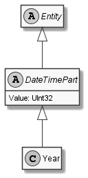

# Year

## Generally

|Property|Value|
|:-|:-|
|Description|The year of an date.|
|Namespace|DoofesZeug.Entities.DateAndTime.Part.Date|
|BaseClass|DateTimePart|
|SourceCode|[Year.cs](../../../../DoofesZeug.Library/Src/Entities/DateAndTime/Part/Date/Year.cs)|

---

## Properties

### Declared

|Name|Type|Read|Write|DefaultValue|
|:---|:---|:--:|:---:|:-----------|

### Inherited

|Name|Type|Read|Write|DefaultValue|
|:---|:---|:--:|:---:|:-----------|
|Value|UInt32|&#x2713;|&#x2713;|0|

---

## Attributes

- Description

---

## UML Diagram



---

## Code Example

```cs
An example or code snippet follows soon.
```

---

## JSON Example

```json
3
```

---

