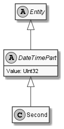

# Second

## Generally

|Property|Value|
|:-|:-|
|Description|The seconds of an time.|
|Namespace|DoofesZeug.Entities.DateAndTime.Part.Time|
|BaseClass|DateTimePart|
|SourceCode|[Second.cs](../../../../DoofesZeug.Library/Src/Entities/DateAndTime/Part/Time/Second.cs)|

---

## Properties

### Declared

|Name|Type|Read|Write|DefaultValue|
|:---|:---|:--:|:---:|:-----------|
|    |    |    |     |            |

### Inherited

|Name|Type|Read|Write|DefaultValue|
|:---|:---|:--:|:---:|:-----------|
|Value|UInt32|&#x2713;|&#x2713;|0|

---

## UML Diagram



---

## Code Example

```cs
An example or code snippet follows soon.
```

---

## Console Example

```console
┌──────────┬───────┐
│ Property │ Value │
├──────────┼───────┤
│ Value    │ 3     │
└──────────┴───────┘
```

---

## JSON Example

```json
3
```

---

## YAML Example

```yaml
Value: 3
```

---

<hr style="background: blue;" />
