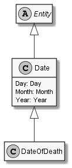

# DateOfDeath

## Generally

|Property|Value|
|:-|:-|
|Description|An date of death (without the time) for creatures.|
|Namespace|DoofesZeug.Entities.DateAndTime|
|BaseClass|Date|
|SourceCode|[DateOfDeath.cs](../../../../DoofesZeug.Library/Src/Entities/DateAndTime/DateOfDeath.cs)|

---

## Properties

### Declared

|Name|Type|Read|Write|DefaultValue|
|:---|:---|:--:|:---:|:-----------|

### Inherited

|Name|Type|Read|Write|DefaultValue|
|:---|:---|:--:|:---:|:-----------|
|Day|[Day](../../Entities/DoofesZeug.Entities.DateAndTime.Part.Date/Day.md)|&#x2713;|&#x2713;|NULL|
|Month|[Month](../../Entities/DoofesZeug.Entities.DateAndTime.Part.Date/Month.md)|&#x2713;|&#x2713;|NULL|
|Year|[Year](../../Entities/DoofesZeug.Entities.DateAndTime.Part.Date/Year.md)|&#x2713;|&#x2713;|NULL|

---

## Attributes

- Description

---

## UML Diagram



---

## Code Example

```cs
An example or code snippet follows soon.
```

---

## JSON Example

```json
"16.06.1990"
```

---

