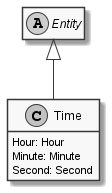

# Time

## Generally

|Property|Value|
|:-|:-|
|Description|An time entity with hours, minutes and the seconds (12:34:56).|
|Namespace|DoofesZeug.Entities.DateAndTime|
|BaseClass|Entity|
|SourceCode|[Time.cs](../../../../DoofesZeug.Library/Src/Entities/DateAndTime/Time.cs)|

---

## Properties

### Declared

|Name|Type|Read|Write|DefaultValue|
|:---|:---|:--:|:---:|:-----------|
|Hour|[Hour](../../Entities/DoofesZeug.Entities.DateAndTime.Part.Time/Hour.md)|&#x2713;|&#x2713;|NULL|
|Minute|[Minute](../../Entities/DoofesZeug.Entities.DateAndTime.Part.Time/Minute.md)|&#x2713;|&#x2713;|NULL|
|Second|[Second](../../Entities/DoofesZeug.Entities.DateAndTime.Part.Time/Second.md)|&#x2713;|&#x2713;|NULL|

### Inherited

|Name|Type|Read|Write|DefaultValue|
|:---|:---|:--:|:---:|:-----------|
|    |    |    |     |            |

---

## Attributes

- Description

---

## UML Diagram



---

## Code Example

```cs
An example or code snippet follows soon.
```

---

## JSON Example

```json
{
  "Hour": 12,
  "Minute": 43,
  "Second": 56
}
```

---

