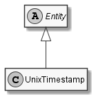

# UnixTimestamp

## Generally

|Property|Value|
|:-|:-|
|Description|An unix timestamp (seconds since 01.01.1970).|
|Namespace|DoofesZeug.Entities.DateAndTime|
|BaseClass|Entity|
|SourceCode|[UnixTimestamp.cs](../../../../DoofesZeug.Library/Src/Entities/DateAndTime/UnixTimestamp.cs)|

---

## Properties

### Declared

|Name|Type|Read|Write|DefaultValue|
|:---|:---|:--:|:---:|:-----------|
|    |    |    |     |            |

### Inherited

|Name|Type|Read|Write|DefaultValue|
|:---|:---|:--:|:---:|:-----------|
|    |    |    |     |            |

---

## UML Diagram



---

## Code Example

```cs
An example or code snippet follows soon.
```

---

## Console Example

```console
┌──────────┬───────┐
│ Property │ Value │
├──────────┼───────┤
└──────────┴───────┘
```

---

## JSON Example

```json
1634318700
```

---

## YAML Example

```yaml
{}
```

<hr style="background: blue;" />
