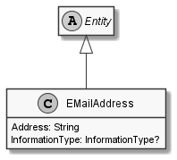

# EMailAddress

## Generally

|Property|Value|
|:-|:-|
|Description|An simplified emailaddress.|
|Namespace|DoofesZeug.Entities.ManMade.Communication|
|BaseClass|IdentifiableEntity|
|SourceCode|[EMailAddress.cs](../../../../DoofesZeug.Library/Src/Entities/ManMade/Communication/EMailAddress.cs)|

---

## Properties

### Declared

|Name|Type|Read|Write|DefaultValue|
|:---|:---|:--:|:---:|:-----------|
|Address|String|&#x2713;|&#x2713;|NULL|
|InformationType|InformationType?|&#x2713;|&#x2713;|NULL|

### Inherited

|Name|Type|Read|Write|DefaultValue|
|:---|:---|:--:|:---:|:-----------|
|Id|Guid|&#x2713;|&#x2713;|Guid.NewGuid()|

---

## Attributes

- Description

---

## UML Diagram



---

## Code Example

```cs
An example or code snippet follows soon.
```

---

## JSON Example

```json
{
  "Address": "obiwanlansi@github.com",
  "InformationType": "Business",
  "Id": "5cda6204-9309-477f-84b2-0e8d0705fbe4"
}
```

---

