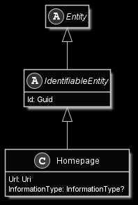

# Homepage

## Generally

|Property|Value|
|:-|:-|
|Description|An simple link to an homepage.|
|Namespace|DoofesZeug.Entities.ManMade.Communication|
|BaseClass|IdentifiableEntity|
|SourceCode|[Homepage.cs](../../../../DoofesZeug.Library/Src/Entities/ManMade/Communication/Homepage.cs)|

---

## Properties

### Declared

|Name|Type|Read|Write|DefaultValue|
|:---|:---|:--:|:---:|:-----------|
|Url|Uri|&#x2713;|&#x2713;|NULL|
|InformationType|InformationType?|&#x2713;|&#x2713;|NULL|

### Inherited

|Name|Type|Read|Write|DefaultValue|
|:---|:---|:--:|:---:|:-----------|
|Id|Guid|&#x2713;|&#x2713;|Guid.NewGuid()|

---

## Attributes

- Description

---

## UML Diagram



---

## Code Example

```cs
An example or code snippet follows soon.
```

---

## JSON Example

```json
{
  "Url": "https://github.com/ObiWanLansi",
  "InformationType": "Business",
  "Id": "987a0a56-3c4b-4fc6-9765-1a92bf97832e"
}
```

---

