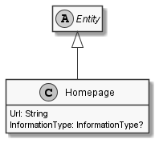

# Homepage

## Generally

|Property|Value|
|:-|:-|
|Description|An simple link to an homepage.|
|Namespace|DoofesZeug.Entities.ManMade.Communication|
|BaseClass|Entity|
|SourceCode|[Homepage.cs](../../../../DoofesZeug.Library/Src/Entities/ManMade/Communication/Homepage.cs)|

---

## Properties

### Declared

|Name|Type|Read|Write|DefaultValue|
|:---|:---|:--:|:---:|:-----------|
|Url|String|&#x2713;|&#x2713;|NULL|
|InformationType|InformationType?|&#x2713;|&#x2713;|NULL|

### Inherited

|Name|Type|Read|Write|DefaultValue|
|:---|:---|:--:|:---:|:-----------|
|    |    |    |     |            |

---

## UML Diagram



---

## Code Example

```cs
An example or code snippet follows soon.
```

---

## Console Example

```console
┌─────────────────┬────────────────────────────────┐
│ Property        │ Value                          │
├─────────────────┼────────────────────────────────┤
│ Url             │ https://github.com/ObiWanLansi │
│ InformationType │ Business                       │
└─────────────────┴────────────────────────────────┘
```

---

## JSON Example

```json
{
  "Url": "https://github.com/ObiWanLansi",
  "InformationType": "Business"
}
```

---

## YAML Example

```yaml
Url: https://github.com/ObiWanLansi
InformationType: Business
```

---

<hr style="background: blue;" />
