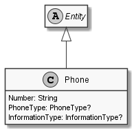

# Phone

## Generally

|Property|Value|
|:-|:-|
|Description|An simple phonenumber.|
|Namespace|DoofesZeug.Entities.ManMade.Communication|
|BaseClass|IdentifiableEntity|
|SourceCode|[Phone.cs](../../../../DoofesZeug.Library/Src/Entities/ManMade/Communication/Phone.cs)|

---

## Properties

### Declared

|Name|Type|Read|Write|DefaultValue|
|:---|:---|:--:|:---:|:-----------|
|Number|String|&#x2713;|&#x2713;|NULL|
|PhoneType|PhoneType?|&#x2713;|&#x2713;|NULL|
|InformationType|InformationType?|&#x2713;|&#x2713;|NULL|

### Inherited

|Name|Type|Read|Write|DefaultValue|
|:---|:---|:--:|:---:|:-----------|
|Id|Guid|&#x2713;|&#x2713;|Guid.NewGuid()|

---

## Attributes

- Description

---

## UML Diagram



---

## Code Example

```cs
An example or code snippet follows soon.
```

---

## JSON Example

```json
{
  "Number": "+49 54321 424269",
  "PhoneType": null,
  "InformationType": null,
  "Id": "bf73a200-77d5-4ab4-bdc1-c7bf4ffcb289"
}
```

---

