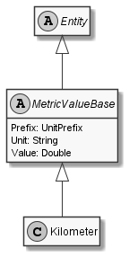

# Kilometer

## Generally

|Property|Value|
|:-|:-|
|Description|This entity represents just a kilometer.|
|Namespace|DoofesZeug.Entities.Science.Base.Length|
|BaseClass|MetricValueBase|
|SourceCode|[Kilometer.cs](../../../../DoofesZeug.Library/Src/Entities/Science/Base/Length/Kilometer.cs)|
|See Also|https://en.wikipedia.org/wiki/Metre|

---

## Properties

### Declared

|Name|Type|Read|Write|DefaultValue|
|:---|:---|:--:|:---:|:-----------|
|    |    |    |     |            |

### Inherited

|Name|Type|Read|Write|DefaultValue|
|:---|:---|:--:|:---:|:-----------|
|Prefix|[UnitPrefix](../../Entities/DoofesZeug.Datatypes.Misc/UnitPrefix.md)|&#x2713;|&#x2713;|Kilo|
|Unit|String|&#x2713;|&#x2713;|m|
|Value|Double|&#x2713;|&#x2713;|0|

---

## UML Diagram



---

## Code Example

```cs
An example or code snippet follows soon.
```

---

## Console Example

```console
┌──────────┬───────┐
│ Property │ Value │
├──────────┼───────┤
│ Prefix   │ Kilo  │
│ Unit     │ m     │
│ Value    │ 12,34 │
└──────────┴───────┘
```

---

## JSON Example

```json
{
  "Prefix": "Kilo",
  "Unit": "m",
  "Value": 12.34
}
```

---

## YAML Example

```yaml
Prefix:
  Name: Kilo
  Symbol: k
  Factor: 1000
Unit: m
Value: 12.34
```

---

<hr style="background: blue;" />
