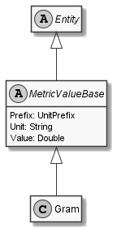

# Gram

## Generally

|Property|Value|
|:-|:-|
|Description|This entity represents just a gram.|
|Namespace|DoofesZeug.Entities.Science.Base.Weight|
|BaseClass|MetricValueBase|
|SourceCode|[Gram.cs](../../../../DoofesZeug.Library/Src/Entities/Science/Base/Weight/Gram.cs)|
|See Also|https://en.wikipedia.org/wiki/Gram|

---

## Properties

### Declared

|Name|Type|Read|Write|DefaultValue|
|:---|:---|:--:|:---:|:-----------|

### Inherited

|Name|Type|Read|Write|DefaultValue|
|:---|:---|:--:|:---:|:-----------|
|Prefix|[UnitPrefix](../../Entities/DoofesZeug.Datatypes.Misc/UnitPrefix.md)|&#x2713;|&#x2713;|DoofesZeug.Datatypes.Misc.UnitPrefix|
|Unit|String|&#x2713;|&#x2713;|g|
|Value|Double|&#x2713;|&#x2713;|0|

---

## Attributes

- Description
- Link

---

## UML Diagram



---

## Code Example

```cs
An example or code snippet follows soon.
```

---

## JSON Example

```json
{
  "Prefix": "Base",
  "Unit": "g",
  "Value": 42123.0
}
```

---

