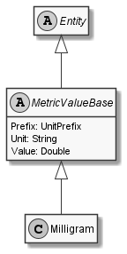

# Milligram

## Generally

|Property|Value|
|:-|:-|
|Description|This entity represents just a milligram.|
|Namespace|DoofesZeug.Entities.Science.Base.Weight|
|BaseClass|MetricValueBase|
|SourceCode|[Milligram.cs](../../../../DoofesZeug.Library/Src/Entities/Science/Base/Weight/Milligram.cs)|
|See Also|https://en.wikipedia.org/wiki/Gram|

---

## Properties

### Declared

|Name|Type|Read|Write|DefaultValue|
|:---|:---|:--:|:---:|:-----------|
|    |    |    |     |            |

### Inherited

|Name|Type|Read|Write|DefaultValue|
|:---|:---|:--:|:---:|:-----------|
|Prefix|[UnitPrefix](../../Entities/DoofesZeug.Datatypes.Misc/UnitPrefix.md)|&#x2713;|&#x2713;|Milli|
|Unit|String|&#x2713;|&#x2713;|g|
|Value|Double|&#x2713;|&#x2713;|0|

---

## UML Diagram



---

## Code Example

```cs
An example or code snippet follows soon.
```

---

## Console Example

```console
┌──────────┬───────┐
│ Property │ Value │
├──────────┼───────┤
│ Prefix   │ Milli │
│ Unit     │ g     │
│ Value    │ 123   │
└──────────┴───────┘
```

---

## JSON Example

```json
{
  "Prefix": "Milli",
  "Unit": "g",
  "Value": 123.0
}
```

---

## YAML Example

```yaml
Prefix:
  Name: Milli
  Symbol: m
  Factor: 0.001
Unit: g
Value: 123
```

---

<hr style="background: blue;" />
