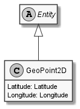

# GeoPoint2D

## Generally

|Property|Value|
|:-|:-|
|Description|An simplified geo point with lat and lon (WGS84).|
|Namespace|DoofesZeug.Entities.Science.Geographically.Coordinates|
|BaseClass|Entity|
|SourceCode|[GeoPoint2D.cs](../../../../DoofesZeug.Library/Src/Entities/Science/Geographically/Coordinates/GeoPoint2D.cs)|

---

## Properties

### Declared

|Name|Type|Read|Write|DefaultValue|
|:---|:---|:--:|:---:|:-----------|
|Latitude|[Latitude](../../Entities/DoofesZeug.Entities.Science.Geographically.Coordinates/Latitude.md)|&#x2713;|&#x2713;|NULL|
|Longitude|[Longitude](../../Entities/DoofesZeug.Entities.Science.Geographically.Coordinates/Longitude.md)|&#x2713;|&#x2713;|NULL|

### Inherited

|Name|Type|Read|Write|DefaultValue|
|:---|:---|:--:|:---:|:-----------|
|    |    |    |     |            |

---

## UML Diagram



---

## Code Example

```cs
An example or code snippet follows soon.
```

---

## Console Example

```console
┌───────────┬────────────────────┐
│ Property  │ Value              │
├───────────┼────────────────────┤
│ Latitude  │ 49.759646524258756 │
│ Longitude │ 6.644282639342397  │
└───────────┴────────────────────┘
```

---

## JSON Example

```json
{
  "Latitude": 49.759646524258756,
  "Longitude": 6.644282639342397
}
```

---

## YAML Example

```yaml
Latitude: {}
Longitude: {}
```

<hr style="background: blue;" />
