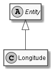

# Longitude

## Generally

|Property|Value|
|:-|:-|
|Description|An simplified longitude (WGS84).|
|Namespace|DoofesZeug.Entities.Science.Geographically.Coordinates|
|BaseClass|Entity|
|SourceCode|[Longitude.cs](../../../../DoofesZeug.Library/Src/Entities/Science/Geographically/Coordinates/Longitude.cs)|

---

## Properties

### Declared

|Name|Type|Read|Write|DefaultValue|
|:---|:---|:--:|:---:|:-----------|

### Inherited

|Name|Type|Read|Write|DefaultValue|
|:---|:---|:--:|:---:|:-----------|

---

## Attributes

- Description

---

## UML Diagram



---

## Code Example

```cs
An example or code snippet follows soon.
```

---

## JSON Example

```json
{}
```

---

