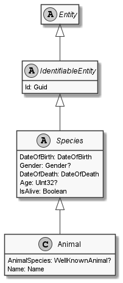

# Animal

## Generally

|Property|Value|
|:-|:-|
|Description|An simplified animal with an firstname, lastname, birthday and some other optional properties.|
|Namespace|DoofesZeug.Entities.Specieses.Animals|
|BaseClass|Species|
|SourceCode|[Animal.cs](../../../../DoofesZeug.Library/Src/Entities/Specieses/Animals/Animal.cs)|

---

## Properties

### Declared

|Name|Type|Read|Write|DefaultValue|
|:---|:---|:--:|:---:|:-----------|
|AnimalSpecies|WellKnownAnimal?|&#x2713;|&#x2713;|NULL|
|Name|[Name](../../Entities/DoofesZeug.Entities.Specieses/Name.md)|&#x2713;|&#x2713;|NULL|

### Inherited

|Name|Type|Read|Write|DefaultValue|
|:---|:---|:--:|:---:|:-----------|
|DateOfBirth|[DateOfBirth](../../Entities/DoofesZeug.Entities.DateAndTime/DateOfBirth.md)|&#x2713;|&#x2713;|NULL|
|Gender|Gender?|&#x2713;|&#x2713;|NULL|
|Id|Guid|&#x2713;|&#x2713;|Guid.NewGuid()|

---

## Attributes

- Description
- Builder

---

## UML Diagram



---

## Code Example

```cs
An example or code snippet follows soon.
```

---

## JSON Example

```json
{
  "AnimalSpecies": "Cat",
  "Name": "Garfield",
  "DateOfBirth": "10.06.1978",
  "Gender": "Male",
  "Id": "6e06b430-02c5-49d1-ac39-c011036ce5ee"
}
```

---

