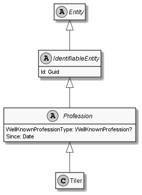

# Tiler

## Generally

|Property|Value|
|:-|:-|
|Description|This is an specialized entitiy for an tiler.|
|Namespace|DoofesZeug.Entities.Specieses.Human.Professions|
|BaseClass|Profession|
|SourceCode|[Tiler.cs](../../../../DoofesZeug.Library/Src/Entities/Specieses/Human/Professions/Tiler.cs)|

---

## Properties

### Declared

|Name|Type|Read|Write|DefaultValue|
|:---|:---|:--:|:---:|:-----------|

### Inherited

|Name|Type|Read|Write|DefaultValue|
|:---|:---|:--:|:---:|:-----------|
|WellKnownProfessionType|WellKnownProfession?|&#x2713;|&#x2717;|Tiler|
|Since|[Date](../../Entities/DoofesZeug.Entities.DateAndTime/Date.md)|&#x2713;|&#x2713;|NULL|
|Id|Guid|&#x2713;|&#x2713;|Guid.NewGuid()|

---

## Attributes

- Description
- Generated
- Builder

---

## UML Diagram



---

## Code Example

```cs
An example or code snippet follows soon.
```

---

## JSON Example

```json
{
  "Id": "0f86a6e2-2c20-4bd8-b90c-6e12a54cacf1",
  "WellKnownProfessionType": "Tiler",
  "Since": "11.11.1942"
}
```

---

