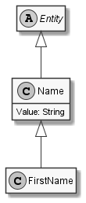

# FirstName

## Generally

|Property|Value|
|:-|:-|
|Description|An firstname for humans.|
|Namespace|DoofesZeug.Entities.Specieses.Human|
|BaseClass|Name|
|SourceCode|[FirstName.cs](../../../../DoofesZeug.Library/Src/Entities/Specieses/Human/FirstName.cs)|

---

## Properties

### Declared

|Name|Type|Read|Write|DefaultValue|
|:---|:---|:--:|:---:|:-----------|
|    |    |    |     |            |

### Inherited

|Name|Type|Read|Write|DefaultValue|
|:---|:---|:--:|:---:|:-----------|
|Value|String|&#x2713;|&#x2713;|NULL|

---

## UML Diagram



---

## Code Example

```cs
An example or code snippet follows soon.
```

---

## Console Example

```console
┌──────────┬───────┐
│ Property │ Value │
├──────────┼───────┤
│ Value    │ Erika │
└──────────┴───────┘
```

---

## JSON Example

```json
"Erika"
```

---

## YAML Example

```yaml
Value: Erika
```

---

<hr style="background: blue;" />
