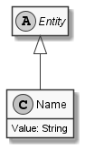

# Name

## Generally

|Property|Value|
|:-|:-|
|Description|An generic name for any species.|
|Namespace|DoofesZeug.Entities.Specieses|
|BaseClass|Entity|
|SourceCode|[Name.cs](../../../../DoofesZeug.Library/Src/Entities/Specieses/Name.cs)|

---

## Properties

### Declared

|Name|Type|Read|Write|DefaultValue|
|:---|:---|:--:|:---:|:-----------|
|Value|String|&#x2713;|&#x2713;|NULL|

### Inherited

|Name|Type|Read|Write|DefaultValue|
|:---|:---|:--:|:---:|:-----------|

---

## Attributes

- Description
- Range

---

## UML Diagram



---

## Code Example

```cs
An example or code snippet follows soon.
```

---

## JSON Example

```json
"HurzFurz"
```

---

