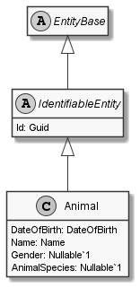

# Animal

## Generally

|||
|:-|:-|
|Description|An simplified animal with an firstname, lastname, birthday and some other optional properties.|
|Namespace|DoofesZeug.Models.Animals|
|BaseClass|IdentifiableEntity|

## Properties

### Declared

|Name|Type|Read|Write|DefaultValue|
|:---|:---|:--:|:---:|:-----------|
|DateOfBirth|[DateOfBirth](../../Models/DoofesZeug.Models.DateAndTime/DateOfBirth.md)|&#x2713;|&#x2713;|NULL|
|Name|[Name](../../Models/DoofesZeug.Models.Human/Name.md)|&#x2713;|&#x2713;|NULL|
|Gender|[Gender](../../Enumerations/DoofesZeug.Models.Human/Gender.md)|&#x2713;|&#x2713;|Unknown|
|AnimalSpecies|[AnimalSpecies](../../Enumerations/DoofesZeug.Models.Animals/AnimalSpecies.md)|&#x2713;|&#x2713;|Unknown|

### Inherited

|Name|Type|Read|Write|DefaultValue|
|:---|:---|:--:|:---:|:-----------|
|Id|Guid|&#x2713;|&#x2713;|93790974-5430-4d90-8326-3721af3f14ac|

## Attributes

- Description
- Builder

## UML Diagram



## JSON Example

```json
{
  "DateOfBirth": "10.06.1978",
  "Name": "Garfield",
  "Gender": "Male",
  "AnimalSpecies": "Cat",
  "Id": "5d6d10ff-618f-49e3-8ba9-c2eba7a93ed3"
}
```

