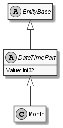

# Month

## Generally

|||
|:-|:-|
|Namespace|DoofesZeug.Models.Datatypes.DateAndTime.Part.Date|
|BaseClass|DateTimePart|

## Fields

### Declared

|Name|Type|Read|Write|DefaultValue|
|:---|:---|:--:|:---:|:-----------|

### Inherited

|Name|Type|Read|Write|DefaultValue|
|:---|:---|:--:|:---:|:-----------|
|Value|Int32|&#x2713;|&#x2713;||

## Attributes

## Diagram

## Example

