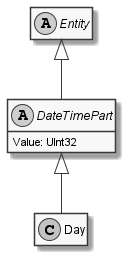

# Day

## Generally

|||
|:-|:-|
|Namespace|DoofesZeug.Models.DateAndTime.Part.Date|
|BaseClass|DateTimePart|

## Fields

|Name|Type|Read|Write|DefaultValue|
|:---|:---|:--:|:---:|:-----------|

## Attributes

## Diagram

## Example

