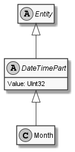

# Month

## Generally

|Property|Value|
|:-|:-|
|Description|The month of an date.|
|Namespace|DoofesZeug.Models.DateAndTime.Part.Date|
|BaseClass|DateTimePart|
|SourceCode|[Month.cs](../../../../DoofesZeug.Library/Src/Models/DateAndTime/Part/Date/Month.cs)|

---

## Properties

### Declared

|Name|Type|Read|Write|DefaultValue|
|:---|:---|:--:|:---:|:-----------|

### Inherited

|Name|Type|Read|Write|DefaultValue|
|:---|:---|:--:|:---:|:-----------|
|Value|UInt32|&#x2713;|&#x2713;|0|

---

## Attributes

- Description
- Range

---

## UML Diagram



---

## Code Example

```cs
An exmaple or code snippet follows soon.
```

---

## JSON Example

```json
3
```

---

