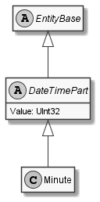

# Minute

## Generally

|||
|:-|:-|
|Description|The minutes of an time.|
|Namespace|DoofesZeug.Models.DateAndTime.Part.Time|
|BaseClass|DateTimePart|

## Properties

### Declared

|Name|Type|Read|Write|DefaultValue|
|:---|:---|:--:|:---:|:-----------|

### Inherited

|Name|Type|Read|Write|DefaultValue|
|:---|:---|:--:|:---:|:-----------|
|Value|UInt32|&#x2713;|&#x2713;|0|

## Attributes

- Description
- Range

## UML Diagram



## JSON Example

```json
3
```

