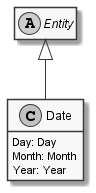

# Date

## Generally

|||
|:-|:-|
|Namespace|DoofesZeug.Models.DateAndTime|
|BaseClass|EntityBase|

## Properties

### Declared

|Name|Type|Read|Write|DefaultValue|
|:---|:---|:--:|:---:|:-----------|
|Day|[Day](../../Models/DoofesZeug.Models.DateAndTime.Part.Date\Day.md)|&#x2713;|&#x2713;||
|Month|[Month](../../Models/DoofesZeug.Models.DateAndTime.Part.Date\Month.md)|&#x2713;|&#x2713;||
|Year|[Year](../../Models/DoofesZeug.Models.DateAndTime.Part.Date\Year.md)|&#x2713;|&#x2713;||

### Inherited

|Name|Type|Read|Write|DefaultValue|
|:---|:---|:--:|:---:|:-----------|

## Attributes

**TODO**

## UML Diagram



## JSON Example

```json
{
  "Day": 11,
  "Month": 11,
  "Year": 1942
}
```

