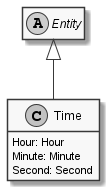

# Time

## Generally

|||
|:-|:-|
|Namespace|DoofesZeug.Models.DateAndTime|
|BaseClass|EntityBase|

## Properties

### Declared

|Name|Type|Read|Write|DefaultValue|
|:---|:---|:--:|:---:|:-----------|
|Hour|[Hour](../../Models/DoofesZeug.Models.DateAndTime.Part.Time\Hour.md)|&#x2713;|&#x2713;|NULL|
|Minute|[Minute](../../Models/DoofesZeug.Models.DateAndTime.Part.Time\Minute.md)|&#x2713;|&#x2713;|NULL|
|Second|[Second](../../Models/DoofesZeug.Models.DateAndTime.Part.Time\Second.md)|&#x2713;|&#x2713;|NULL|

### Inherited

|Name|Type|Read|Write|DefaultValue|
|:---|:---|:--:|:---:|:-----------|

## Attributes

**TODO**

## UML Diagram



## JSON Example

```json
{
  "Hour": 12,
  "Minute": 43,
  "Second": 56
}
```

