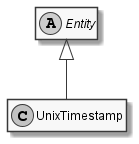

# UnixTimestamp

## Generally

|Property|Value|
|:-|:-|
|Description|An unix timestamp (seconds since 01.01.1970).|
|Namespace|DoofesZeug.Models.DateAndTime|
|BaseClass|EntityBase|
|SourceCode|[UnixTimestamp.cs](../../../../DoofesZeug.Library/Src/Models/DateAndTime/UnixTimestamp.cs)|

---

## Properties

### Declared

|Name|Type|Read|Write|DefaultValue|
|:---|:---|:--:|:---:|:-----------|

### Inherited

|Name|Type|Read|Write|DefaultValue|
|:---|:---|:--:|:---:|:-----------|

---

## Attributes

- Description

---

## UML Diagram



---

## Code Example

```cs
An example or code snippet follows soon.
```

---

## JSON Example

```json
1631400902
```

---

