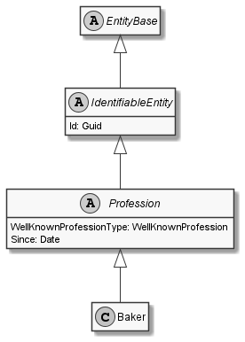

# Baker

## Generally

|||
|:-|:-|
|Namespace|DoofesZeug.Models.Human.Professions|
|BaseClass|Profession|

## Properties

### Declared

|Name|Type|Read|Write|DefaultValue|
|:---|:---|:--:|:---:|:-----------|

### Inherited

|Name|Type|Read|Write|DefaultValue|
|:---|:---|:--:|:---:|:-----------|
|WellKnownProfessionType|[WellKnownProfession](../../Enumerations/DoofesZeug.Models.Human.Professions\WellKnownProfession.md)|&#x2713;|&#x2717;|Baker|
|Since|[Date](../../Models/DoofesZeug.Models.DateAndTime\Date.md)|&#x2713;|&#x2713;|01.01.0001|
|Id|Guid|&#x2713;|&#x2713;|2d2b06d5-20bf-426a-b533-c992f0da4b96|

## Attributes

**TODO**

## UML Diagram



## JSON Example

```json
{
  "Id": "72ab5f64-cc32-402b-bad4-35874c98403f",
  "WellKnownProfessionType": "Baker",
  "Since": "11.11.1942"
}
```

