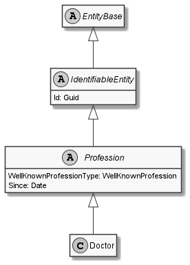

# Doctor

## Generally

|||
|:-|:-|
|Description|This is an specialized entitiy for an doctor.|
|Namespace|DoofesZeug.Models.Human.Professions|
|BaseClass|Profession|

## Properties

### Declared

|Name|Type|Read|Write|DefaultValue|
|:---|:---|:--:|:---:|:-----------|

### Inherited

|Name|Type|Read|Write|DefaultValue|
|:---|:---|:--:|:---:|:-----------|
|WellKnownProfessionType|[WellKnownProfession](../../Enumerations/DoofesZeug.Models.Human.Professions/WellKnownProfession.md)|&#x2713;|&#x2717;|Doctor|
|Since|[Date](../../Models/DoofesZeug.Models.DateAndTime/Date.md)|&#x2713;|&#x2713;|NULL|
|Id|Guid|&#x2713;|&#x2713;|72cd51c7-46ec-43e8-a2d6-5ae3fe5f4b7f|

## Attributes

- Description
- Generated
- Builder

## UML Diagram



## JSON Example

```json
{
  "Id": "87697658-38cb-4cb3-94c1-d12d64034d8f",
  "WellKnownProfessionType": "Doctor",
  "Since": "11.11.1942"
}
```

