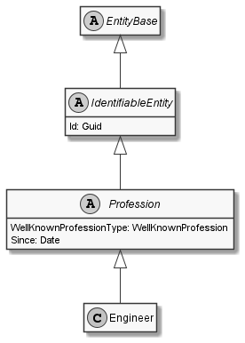

# Engineer

## Generally

|||
|:-|:-|
|Namespace|DoofesZeug.Models.Human.Professions|
|BaseClass|Profession|

## Properties

### Declared

|Name|Type|Read|Write|DefaultValue|
|:---|:---|:--:|:---:|:-----------|

### Inherited

|Name|Type|Read|Write|DefaultValue|
|:---|:---|:--:|:---:|:-----------|
|WellKnownProfessionType|[WellKnownProfession](../../Enumerations/DoofesZeug.Models.Human.Professions\WellKnownProfession.md)|&#x2713;|&#x2717;|Engineer|
|Since|[Date](../../Models/DoofesZeug.Models.DateAndTime\Date.md)|&#x2713;|&#x2713;|01.01.0001|
|Id|Guid|&#x2713;|&#x2713;|22e02a7e-b0ab-4b30-b22b-a0f959101b72|

## Attributes

**TODO**

## UML Diagram



## JSON Example

```json
{
  "Id": "76703ff6-adf2-4fcc-ac03-c186bc4baec3",
  "WellKnownProfessionType": "Engineer",
  "Since": "11.11.1942"
}
```

