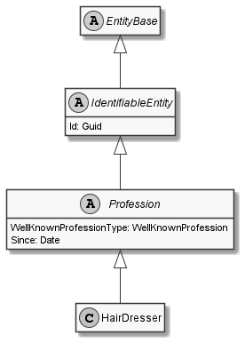

# HairDresser

## Generally

|||
|:-|:-|
|Namespace|DoofesZeug.Models.Human.Professions|
|BaseClass|Profession|

## Properties

### Declared

|Name|Type|Read|Write|DefaultValue|
|:---|:---|:--:|:---:|:-----------|

### Inherited

|Name|Type|Read|Write|DefaultValue|
|:---|:---|:--:|:---:|:-----------|
|WellKnownProfessionType|[WellKnownProfession](../../Enumerations/DoofesZeug.Models.Human.Professions\WellKnownProfession.md)|&#x2713;|&#x2717;|HairDresser|
|Since|[Date](../../Models/DoofesZeug.Models.DateAndTime\Date.md)|&#x2713;|&#x2713;|NULL|
|Id|Guid|&#x2713;|&#x2713;|09b1e5fd-fe3c-422d-a75c-98eb84e3148d|

## Attributes

**TODO**

## UML Diagram



## JSON Example

```json
{
  "Id": "3ce01dd3-fef5-4ad5-b31f-a085c6659bef",
  "WellKnownProfessionType": "HairDresser",
  "Since": "11.11.1942"
}
```

