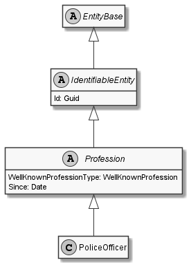

# PoliceOfficer

## Generally

|||
|:-|:-|
|Description|This is an specialized entitiy for an policeofficer.|
|Namespace|DoofesZeug.Models.Human.Professions|
|BaseClass|Profession|

## Properties

### Declared

|Name|Type|Read|Write|DefaultValue|
|:---|:---|:--:|:---:|:-----------|

### Inherited

|Name|Type|Read|Write|DefaultValue|
|:---|:---|:--:|:---:|:-----------|
|WellKnownProfessionType|[WellKnownProfession](../../Enumerations/DoofesZeug.Models.Human.Professions\WellKnownProfession.md)|&#x2713;|&#x2717;|PoliceOfficer|
|Since|[Date](../../Models/DoofesZeug.Models.DateAndTime\Date.md)|&#x2713;|&#x2713;|NULL|
|Id|Guid|&#x2713;|&#x2713;|b76f2282-1dd9-4015-840f-2b8e6b4f4cf4|

## Attributes

- Description
- Generated
- Builder

## UML Diagram



## JSON Example

```json
{
  "Id": "966c519e-7231-491d-b29a-c49c3116a65e",
  "WellKnownProfessionType": "PoliceOfficer",
  "Since": "11.11.1942"
}
```

