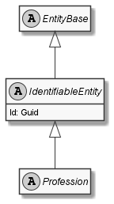

# Profession

## Generally

|||
|:-|:-|
|Namespace|DoofesZeug.Models.Human.Professions|
|BaseClass|IdentifiableEntity|

## Fields

### Declared

|Name|Type|Read|Write|DefaultValue|
|:---|:---|:--:|:---:|:-----------|

### Inherited

|Name|Type|Read|Write|DefaultValue|
|:---|:---|:--:|:---:|:-----------|
|Id|Guid|&#x2713;|&#x2713;||

## Attributes

## Diagram

## Example

