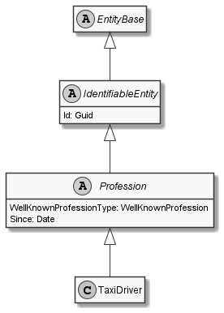

# TaxiDriver

## Generally

|||
|:-|:-|
|Description|This is an specialized entitiy for an taxidriver.|
|Namespace|DoofesZeug.Models.Human.Professions|
|BaseClass|Profession|

## Properties

### Declared

|Name|Type|Read|Write|DefaultValue|
|:---|:---|:--:|:---:|:-----------|

### Inherited

|Name|Type|Read|Write|DefaultValue|
|:---|:---|:--:|:---:|:-----------|
|WellKnownProfessionType|[WellKnownProfession](../../Enumerations/DoofesZeug.Models.Human.Professions/WellKnownProfession.md)|&#x2713;|&#x2717;|TaxiDriver|
|Since|[Date](../../Models/DoofesZeug.Models.DateAndTime/Date.md)|&#x2713;|&#x2713;|NULL|
|Id|Guid|&#x2713;|&#x2713;|efc39348-4c00-403f-8d62-a255bf82a38b|

## Attributes

- Description
- Generated
- Builder

## UML Diagram



## JSON Example

```json
{
  "Id": "6b86d606-9e47-4ff5-999c-2ace947c4b78",
  "WellKnownProfessionType": "TaxiDriver",
  "Since": "11.11.1942"
}
```

