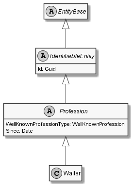

# Waiter

## Generally

|||
|:-|:-|
|Description|This is an specialized entitiy for an waiter.|
|Namespace|DoofesZeug.Models.Human.Professions|
|BaseClass|Profession|

## Properties

### Declared

|Name|Type|Read|Write|DefaultValue|
|:---|:---|:--:|:---:|:-----------|

### Inherited

|Name|Type|Read|Write|DefaultValue|
|:---|:---|:--:|:---:|:-----------|
|WellKnownProfessionType|[WellKnownProfession](../../Enumerations/DoofesZeug.Models.Human.Professions\WellKnownProfession.md)|&#x2713;|&#x2717;|Waiter|
|Since|[Date](../../Models/DoofesZeug.Models.DateAndTime\Date.md)|&#x2713;|&#x2713;|NULL|
|Id|Guid|&#x2713;|&#x2713;|f59e4f8b-06bf-4a4a-8c09-eb3b71e14368|

## Attributes

- Description
- Generated
- Builder

## UML Diagram



## JSON Example

```json
{
  "Id": "05697bef-4f82-41c6-8284-127fde67b4d1",
  "WellKnownProfessionType": "Waiter",
  "Since": "11.11.1942"
}
```

