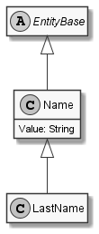

# LastName

## Generally

|||
|:-|:-|
|Namespace|DoofesZeug.Models.Human|
|BaseClass|Name|

## Properties

### Declared

|Name|Type|Read|Write|DefaultValue|
|:---|:---|:--:|:---:|:-----------|

### Inherited

|Name|Type|Read|Write|DefaultValue|
|:---|:---|:--:|:---:|:-----------|
|Value|String|&#x2713;|&#x2713;||

## Attributes

**TODO**

## UML Diagram



## JSON Example

```json
"Mustermann"
```

