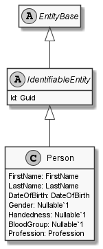

# Person

## Generally

|||
|:-|:-|
|Namespace|DoofesZeug.Models.Human|
|BaseClass|IdentifiableEntity|

## Properties

### Declared

|Name|Type|Read|Write|DefaultValue|
|:---|:---|:--:|:---:|:-----------|
|DateOfBirth|[DateOfBirth](../../Models/DoofesZeug.Models.Human\DateOfBirth.md)|&#x2713;|&#x2713;||
|FirstName|[FirstName](../../Models/DoofesZeug.Models.Human\FirstName.md)|&#x2713;|&#x2713;||
|LastName|[LastName](../../Models/DoofesZeug.Models.Human\LastName.md)|&#x2713;|&#x2713;||
|Gender|[Gender](../../Enumerations/DoofesZeug.Models.Human\Gender.md)|&#x2713;|&#x2713;||
|MainProfession|[Profession](../../Models/DoofesZeug.Models.Human.Professions\Profession.md)|&#x2713;|&#x2713;||

### Inherited

|Name|Type|Read|Write|DefaultValue|
|:---|:---|:--:|:---:|:-----------|
|Id|Guid|&#x2713;|&#x2713;||

## Attributes

**TODO**

## UML Diagram



## JSON Example

```json
{
  "DateOfBirth": "27.09.1974",
  "FirstName": "John",
  "LastName": "Doe",
  "Gender": "Male",
  "MainProfession": {
    "Id": "6f0323ba-5848-4dd4-90f9-1a004a701320",
    "WellKnownProfessionType": "FireFighter",
    "Since": "11.11.1942"
  },
  "Id": "4c67d84f-7727-4042-9ccb-16f2453c91a3"
}
```

