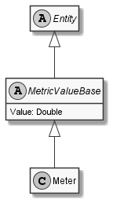

# Meter

## Generally

|Property|Value|
|:-|:-|
|Description|This entity represents just a meter. For easier handling it is based on an double, so we can also set 5.2 m when needed.|
|Namespace|DoofesZeug.Models.Science.Base.Length|
|BaseClass|MetricValueBase`1|
|SourceCode|[Meter.cs](../../../../DoofesZeug.Library/Src/Models/Science/Base/Length/Meter.cs)|

---

## Properties

### Declared

|Name|Type|Read|Write|DefaultValue|
|:---|:---|:--:|:---:|:-----------|

### Inherited

|Name|Type|Read|Write|DefaultValue|
|:---|:---|:--:|:---:|:-----------|
|Value|Double|&#x2713;|&#x2713;|0|

---

## Attributes

- Description

---

## UML Diagram



---

## Code Example

```cs
An example or code snippet follows soon.
```

---

## JSON Example

```json
{
  "Value": 42.42
}
```

---

