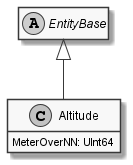

# Altitude

## Generally

|||
|:-|:-|
|Description|An simplified altitude.|
|Namespace|DoofesZeug.Models.Science.Geographically.Base|
|BaseClass|EntityBase|
|SourceCode|[Altitude.cs](../../../../DoofesZeug.Library/Src/Models/Science/Geographically/Base/Altitude.cs)|
|Example||

## Properties

### Declared

|Name|Type|Read|Write|DefaultValue|
|:---|:---|:--:|:---:|:-----------|
|MeterOverNN|UInt64|&#x2713;|&#x2713;|0|

### Inherited

|Name|Type|Read|Write|DefaultValue|
|:---|:---|:--:|:---:|:-----------|

## Attributes

- Description

## UML Diagram



## JSON Example

```json
{
  "MeterOverNN": 42
}
```

