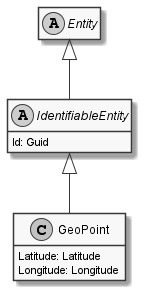

# GeoPoint

## Generally

|Property|Value|
|:-|:-|
|Description|An simplified geo point with lat, lon and alt (WGS84).|
|Namespace|DoofesZeug.Models.Science.Geographically.Base|
|BaseClass|IdentifiableEntity|
|SourceCode|[GeoPoint.cs](../../../../DoofesZeug.Library/Src/Models/Science/Geographically/Base/GeoPoint.cs)|

---

## Properties

### Declared

|Name|Type|Read|Write|DefaultValue|
|:---|:---|:--:|:---:|:-----------|
|Latitude|[Latitude](../../Models/DoofesZeug.Models.Science.Geographically.Base/Latitude.md)|&#x2713;|&#x2713;|NULL|
|Longitude|[Longitude](../../Models/DoofesZeug.Models.Science.Geographically.Base/Longitude.md)|&#x2713;|&#x2713;|NULL|

### Inherited

|Name|Type|Read|Write|DefaultValue|
|:---|:---|:--:|:---:|:-----------|
|Id|Guid|&#x2713;|&#x2713;|Guid.NewGuid()|

---

## Attributes

- Description
- Builder

---

## UML Diagram



---

## Code Example

```cs
An example or code snippet follows soon.
```

---

## JSON Example

```json
"6.644282639342397, 49.759646524258756"
```

---

