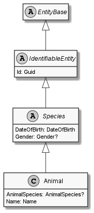

# Animal

## Generally

|||
|:-|:-|
|Description|An simplified animal with an firstname, lastname, birthday and some other optional properties.|
|Namespace|DoofesZeug.Models.Specieses.Animals|
|BaseClass|Species|

## Properties

### Declared

|Name|Type|Read|Write|DefaultValue|
|:---|:---|:--:|:---:|:-----------|
|AnimalSpecies|Nullable`1|&#x2713;|&#x2713;|NULL|
|Name|[Name](../../Models/DoofesZeug.Models.Specieses/Name.md)|&#x2713;|&#x2713;|NULL|

### Inherited

|Name|Type|Read|Write|DefaultValue|
|:---|:---|:--:|:---:|:-----------|
|DateOfBirth|[DateOfBirth](../../Models/DoofesZeug.Models.DateAndTime/DateOfBirth.md)|&#x2713;|&#x2713;|NULL|
|Gender|Nullable`1|&#x2713;|&#x2713;|NULL|
|Id|Guid|&#x2713;|&#x2713;|9b4c1bfb-a37d-4a1a-bee6-726905f85023|

## Attributes

- Description
- Builder

## UML Diagram



## JSON Example

```json
{
  "AnimalSpecies": "Cat",
  "Name": "Garfield",
  "DateOfBirth": "10.06.1978",
  "Gender": "Male",
  "Id": "a926a72c-1b3b-4a8e-a086-915946b3ffce"
}
```

