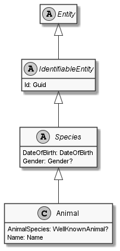

# Animal

## Generally

|||
|:-|:-|
|Description|An simplified animal with an firstname, lastname, birthday and some other optional properties.|
|Namespace|DoofesZeug.Models.Specieses.Animals|
|BaseClass|Species|
|SourceCode|[Animal.cs](../../../../DoofesZeug.Library/Src/Models/Specieses/Animals/Animal.cs)|
|Example||

## Properties

### Declared

|Name|Type|Read|Write|DefaultValue|
|:---|:---|:--:|:---:|:-----------|
|AnimalSpecies|AnimalSpecies?|&#x2713;|&#x2713;|NULL|
|Name|[Name](../../Models/DoofesZeug.Models.Specieses/Name.md)|&#x2713;|&#x2713;|NULL|

### Inherited

|Name|Type|Read|Write|DefaultValue|
|:---|:---|:--:|:---:|:-----------|
|DateOfBirth|[DateOfBirth](../../Models/DoofesZeug.Models.DateAndTime/DateOfBirth.md)|&#x2713;|&#x2713;|NULL|
|Gender|Gender?|&#x2713;|&#x2713;|NULL|
|Id|Guid|&#x2713;|&#x2713;|Guid.NewGuid()|

## Attributes

- Description
- Builder

## UML Diagram



## JSON Example

```json
{
  "AnimalSpecies": "Cat",
  "Name": "Garfield",
  "DateOfBirth": "10.06.1978",
  "Gender": "Male",
  "Id": "d507a593-1ab1-4edf-92e2-2c5ff7ad0fce"
}
```

