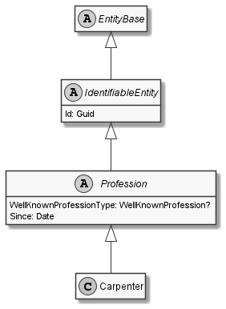

# Carpenter

## Generally

|||
|:-|:-|
|Description|This is an specialized entitiy for an carpenter.|
|Namespace|DoofesZeug.Models.Specieses.Human.Professions|
|BaseClass|Profession|

## Properties

### Declared

|Name|Type|Read|Write|DefaultValue|
|:---|:---|:--:|:---:|:-----------|

### Inherited

|Name|Type|Read|Write|DefaultValue|
|:---|:---|:--:|:---:|:-----------|
|WellKnownProfessionType|WellKnownProfession?|&#x2713;|&#x2717;|Carpenter|
|Since|[Date](../../Models/DoofesZeug.Models.DateAndTime/Date.md)|&#x2713;|&#x2713;|NULL|
|Id|Guid|&#x2713;|&#x2713;|Guid.NewGuid()|

## Attributes

- Description
- Generated
- Builder

## UML Diagram



## JSON Example

```json
{
  "Id": "9500bad2-c510-4056-a42c-e03738ac2e98",
  "WellKnownProfessionType": "Carpenter",
  "Since": "11.11.1942"
}
```

