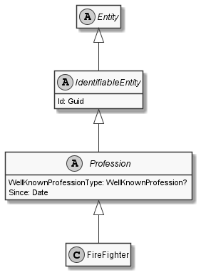

# FireFighter

## Generally

|||
|:-|:-|
|Description|This is an specialized entitiy for an firefighter.|
|Namespace|DoofesZeug.Models.Specieses.Human.Professions|
|BaseClass|Profession|

## Properties

### Declared

|Name|Type|Read|Write|DefaultValue|
|:---|:---|:--:|:---:|:-----------|

### Inherited

|Name|Type|Read|Write|DefaultValue|
|:---|:---|:--:|:---:|:-----------|
|WellKnownProfessionType|Nullable`1|&#x2713;|&#x2717;|FireFighter|
|Since|[Date](../../Models/DoofesZeug.Models.DateAndTime/Date.md)|&#x2713;|&#x2713;|NULL|
|Id|Guid|&#x2713;|&#x2713;|05922918-0216-41fe-8548-4d1d7f991338|

## Attributes

- Description
- Generated
- Builder

## UML Diagram



## JSON Example

```json
{
  "Id": "bc420aae-74e3-47e1-9d4f-42f973ee744a",
  "WellKnownProfessionType": "FireFighter",
  "Since": "11.11.1942"
}
```

