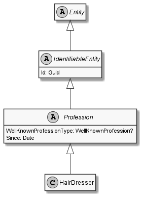

# HairDresser

## Generally

|||
|:-|:-|
|Description|This is an specialized entitiy for an hairdresser.|
|Namespace|DoofesZeug.Models.Specieses.Human.Professions|
|BaseClass|Profession|

## Properties

### Declared

|Name|Type|Read|Write|DefaultValue|
|:---|:---|:--:|:---:|:-----------|

### Inherited

|Name|Type|Read|Write|DefaultValue|
|:---|:---|:--:|:---:|:-----------|
|WellKnownProfessionType|Nullable`1|&#x2713;|&#x2717;|HairDresser|
|Since|[Date](../../Models/DoofesZeug.Models.DateAndTime/Date.md)|&#x2713;|&#x2713;|NULL|
|Id|Guid|&#x2713;|&#x2713;|b70d2936-dddd-48e1-9bbe-b61fcd6c02d7|

## Attributes

- Description
- Generated
- Builder

## UML Diagram



## JSON Example

```json
{
  "Id": "388d1e19-cb55-43f3-b471-20c7044fe5ed",
  "WellKnownProfessionType": "HairDresser",
  "Since": "11.11.1942"
}
```

