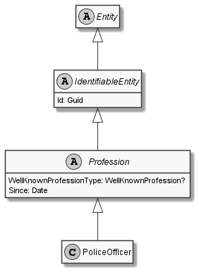

# PoliceOfficer

## Generally

|||
|:-|:-|
|Description|This is an specialized entitiy for an policeofficer.|
|Namespace|DoofesZeug.Models.Specieses.Human.Professions|
|BaseClass|Profession|

## Properties

### Declared

|Name|Type|Read|Write|DefaultValue|
|:---|:---|:--:|:---:|:-----------|

### Inherited

|Name|Type|Read|Write|DefaultValue|
|:---|:---|:--:|:---:|:-----------|
|WellKnownProfessionType|[WellKnownProfession](../../Enumerations/DoofesZeug.Models.Specieses.Human.Professions/WellKnownProfession.md)|&#x2713;|&#x2717;|PoliceOfficer|
|Since|[Date](../../Models/DoofesZeug.Models.DateAndTime/Date.md)|&#x2713;|&#x2713;|NULL|
|Id|Guid|&#x2713;|&#x2713;|f880d3b5-1fa9-4b6e-91db-9e2e0be6ef73|

## Attributes

- Description
- Generated
- Builder

## UML Diagram



## JSON Example

```json
{
  "Id": "4f1b3076-7372-4edb-b1fd-79e66c746342",
  "WellKnownProfessionType": "PoliceOfficer",
  "Since": "11.11.1942"
}
```

