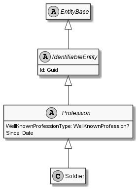

# Soldier

## Generally

|||
|:-|:-|
|Description|This is an specialized entitiy for an soldier.|
|Namespace|DoofesZeug.Models.Specieses.Human.Professions|
|BaseClass|Profession|

## Properties

### Declared

|Name|Type|Read|Write|DefaultValue|
|:---|:---|:--:|:---:|:-----------|

### Inherited

|Name|Type|Read|Write|DefaultValue|
|:---|:---|:--:|:---:|:-----------|
|WellKnownProfessionType|[WellKnownProfession](../../Enumerations/DoofesZeug.Models.Specieses.Human.Professions/WellKnownProfession.md)|&#x2713;|&#x2717;|Soldier|
|Since|[Date](../../Models/DoofesZeug.Models.DateAndTime/Date.md)|&#x2713;|&#x2713;|NULL|
|Id|Guid|&#x2713;|&#x2713;|20491d26-8a1b-4d73-a041-4a7c76715ead|

## Attributes

- Description
- Generated
- Builder

## UML Diagram



## JSON Example

```json
{
  "Id": "f3d78505-7721-4b64-97a8-918d8dc63447",
  "WellKnownProfessionType": "Soldier",
  "Since": "11.11.1942"
}
```

