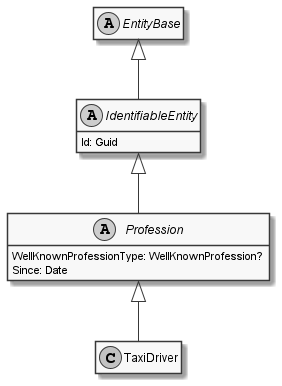

# TaxiDriver

## Generally

|||
|:-|:-|
|Description|This is an specialized entitiy for an taxidriver.|
|Namespace|DoofesZeug.Models.Specieses.Human.Professions|
|BaseClass|Profession|

## Properties

### Declared

|Name|Type|Read|Write|DefaultValue|
|:---|:---|:--:|:---:|:-----------|

### Inherited

|Name|Type|Read|Write|DefaultValue|
|:---|:---|:--:|:---:|:-----------|
|WellKnownProfessionType|[WellKnownProfession](../../Enumerations/DoofesZeug.Models.Specieses.Human.Professions/WellKnownProfession.md)|&#x2713;|&#x2717;|TaxiDriver|
|Since|[Date](../../Models/DoofesZeug.Models.DateAndTime/Date.md)|&#x2713;|&#x2713;|NULL|
|Id|Guid|&#x2713;|&#x2713;|63300048-8db3-4eef-921b-a82fb28c7325|

## Attributes

- Description
- Generated
- Builder

## UML Diagram



## JSON Example

```json
{
  "Id": "17d89422-4fc2-4872-9a01-7d887e991234",
  "WellKnownProfessionType": "TaxiDriver",
  "Since": "11.11.1942"
}
```

