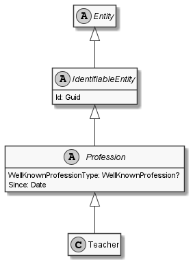

# Teacher

## Generally

|||
|:-|:-|
|Description|This is an specialized entitiy for an teacher.|
|Namespace|DoofesZeug.Models.Specieses.Human.Professions|
|BaseClass|Profession|
|SourceCode|[Teacher.cs](../../../../DoofesZeug.Library/Src/Models/Specieses/Human/Professions/Teacher.cs)|
|Example||

## Properties

### Declared

|Name|Type|Read|Write|DefaultValue|
|:---|:---|:--:|:---:|:-----------|

### Inherited

|Name|Type|Read|Write|DefaultValue|
|:---|:---|:--:|:---:|:-----------|
|WellKnownProfessionType|WellKnownProfession?|&#x2713;|&#x2717;|Teacher|
|Since|[Date](../../Models/DoofesZeug.Models.DateAndTime/Date.md)|&#x2713;|&#x2713;|NULL|
|Id|Guid|&#x2713;|&#x2713;|Guid.NewGuid()|

## Attributes

- Description
- Generated
- Builder

## UML Diagram



## JSON Example

```json
{
  "Id": "4c514ad9-2642-481d-9f34-f63d4dfd06ac",
  "WellKnownProfessionType": "Teacher",
  "Since": "11.11.1942"
}
```

