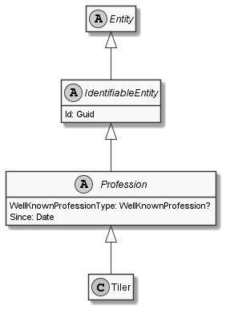

# Tiler

## Generally

|||
|:-|:-|
|Description|This is an specialized entitiy for an tiler.|
|Namespace|DoofesZeug.Models.Specieses.Human.Professions|
|BaseClass|Profession|

## Properties

### Declared

|Name|Type|Read|Write|DefaultValue|
|:---|:---|:--:|:---:|:-----------|

### Inherited

|Name|Type|Read|Write|DefaultValue|
|:---|:---|:--:|:---:|:-----------|
|WellKnownProfessionType|Nullable`1|&#x2713;|&#x2717;|Tiler|
|Since|[Date](../../Models/DoofesZeug.Models.DateAndTime/Date.md)|&#x2713;|&#x2713;|NULL|
|Id|Guid|&#x2713;|&#x2713;|d2a40a6f-bfbd-46fb-8fb9-83fa6c4fc95e|

## Attributes

- Description
- Generated
- Builder

## UML Diagram



## JSON Example

```json
{
  "Id": "a190295b-1821-48de-9ba1-c91235a9608e",
  "WellKnownProfessionType": "Tiler",
  "Since": "11.11.1942"
}
```

