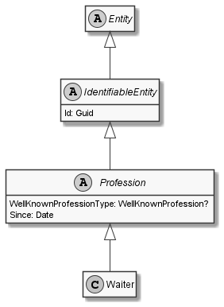

# Waiter

## Generally

|||
|:-|:-|
|Description|This is an specialized entitiy for an waiter.|
|Namespace|DoofesZeug.Models.Specieses.Human.Professions|
|BaseClass|Profession|

## Properties

### Declared

|Name|Type|Read|Write|DefaultValue|
|:---|:---|:--:|:---:|:-----------|

### Inherited

|Name|Type|Read|Write|DefaultValue|
|:---|:---|:--:|:---:|:-----------|
|WellKnownProfessionType|Nullable`1|&#x2713;|&#x2717;|Waiter|
|Since|[Date](../../Models/DoofesZeug.Models.DateAndTime/Date.md)|&#x2713;|&#x2713;|NULL|
|Id|Guid|&#x2713;|&#x2713;|40756820-1782-4ff4-9d03-79bde182238e|

## Attributes

- Description
- Generated
- Builder

## UML Diagram



## JSON Example

```json
{
  "Id": "0a88543e-b64c-4f9b-a22d-545999a530bd",
  "WellKnownProfessionType": "Waiter",
  "Since": "11.11.1942"
}
```

